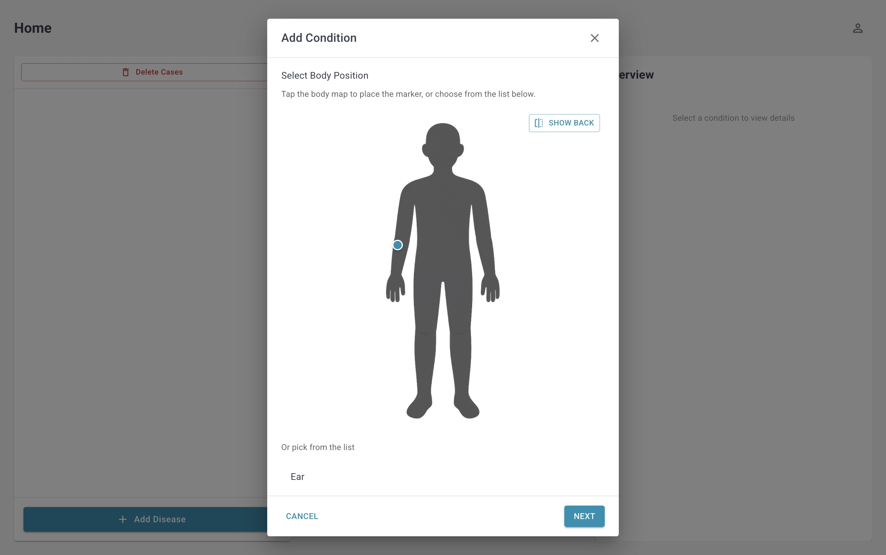
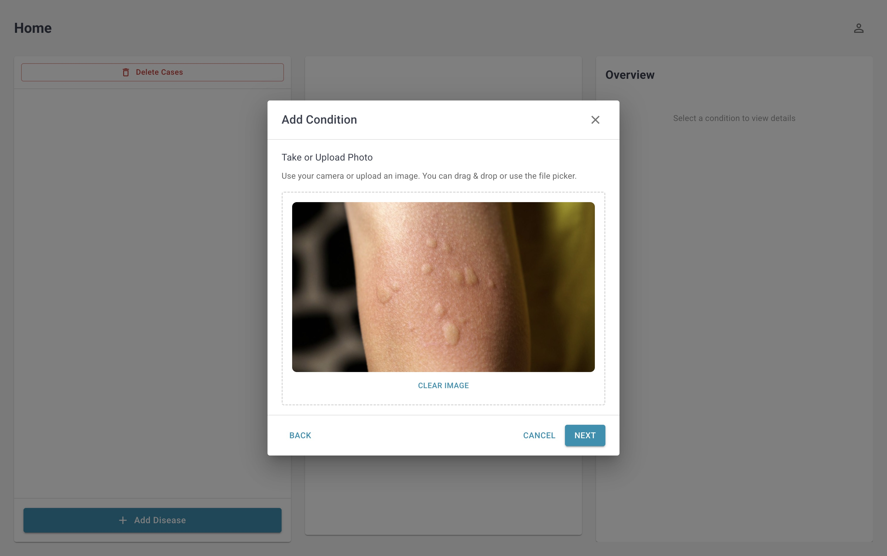
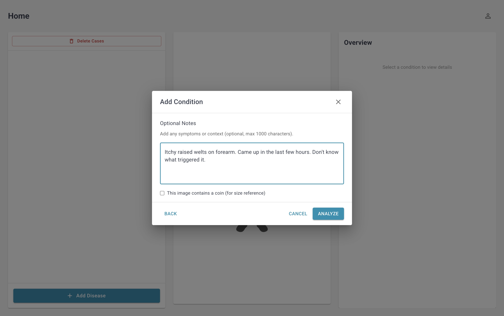

# pibu.ai - Assistant for Identification and Tracking of Skin Conditions

**AC215 Group 127.2473879 - Milestone 5**

**CI/CD Status:**

| Service | Build | Coverage |
|---------|-------|----------|
| **data-processor** | [](https://github.com/nsyousef/ac215_Group_127_2473879/actions) | [](https://github.com/nsyousef/ac215_Group_127_2473879/actions) |
| **llm** | [](https://github.com/nsyousef/ac215_Group_127_2473879/actions) | [](https://github.com/nsyousef/ac215_Group_127_2473879/actions) |
| **inference-cloud** | [](https://github.com/nsyousef/ac215_Group_127_2473879/actions) | [](https://github.com/nsyousef/ac215_Group_127_2473879/actions) |
| **frontend-react** | [](https://github.com/nsyousef/ac215_Group_127_2473879/actions) | [](https://github.com/nsyousef/ac215_Group_127_2473879/actions) |

The total mean testing coverage of all modules is currently 66.5%

**Download from:** https://github.com/nsyousef/pibu_ai_model_release/releases

An AI-powered desktop application for identification and tracking of skin conditions. Combines multiple dermatology datasets with multimodal ML and LLM-based medical explanations to provide personalized skin health insights.

## Project Overview

pibu.ai is a privacy-first desktop application that helps users track and understand skin conditions over time. It combines:

- **Multimodal ML**: Vision and text embeddings for disease classification
- **LLM Assistant**: MedGemma-based explanations and follow-up Q&A
- **Computer Vision**: Automated tracking of changes
- **Local Privacy**: All personal data stored locally on user's device
- **Desktop App**: Electron-based macOS application with Python backend

The system processes multiple dermatology datasets (Fitzpatrick17k, DDI, ISIC, SCIN, Derm1M) into a harmonized dataset and provides a complete ML pipeline for training, deployment, and inference.

## File Structure

```
secrets/
ac215_Group_127_2473879/
└── docs/                          # Project documentation
|   └── milestone5/
|       └── milestone5.md          # Documentation of milestone 5 deliverables
├── eda/                           # Exploratory Data Analysis
└── src/                           # Source code (microservices architecture)
    ├── data-processor/            # Data processing and harmonization
    │   ├── processor_*.py         # Dataset processors (ddi, derm1m, fitz, isic, skincap)
    │   ├── processor.py           # Main processor
    │   ├── harmonize_labels_filter_desc.py  # Label harmonization
    │   ├── verify_output.py       # Output verification
    │   └── tests/                 # Unit tests
    ├── ml_workflow/               # Machine learning training pipeline
    │   ├── dataloader/            # Data loading utilities
    │   ├── model/                 # Model architectures
    │   │   ├── vision/            # Vision models (CNN, ViT)
    │   │   └── classifier/        # Multimodal classifier
    │   ├── train/                 # Training scripts
    │   ├── configs/               # Training configurations
    │   ├── main.py                # Main training entry point
    │   └── modal_*.py             # Modal training scripts
    ├── inference-cloud/           # Cloud inference service
    │   ├── main.py                # Inference API
    │   ├── inference_classifier.py  # Classifier implementation
    │   └── tests/                 # Unit, integration, system tests
    ├── llm/                       # LLM service for medical recommendations
    │   ├── llm.py                 # LLM implementation
    │   ├── llm_modal.py           # Modal deployment
    │   ├── prompts.py             # Prompt templates
    │   └── tests/                 # Unit, integration, system tests
    ├── frontend-react/            # React frontend application
    │   ├── src/                   # React components and pages
    │   │   ├── app/               # Next.js app directory
    │   │   ├── components/        # React components
    │   │   ├── contexts/          # React contexts
    │   │   ├── services/          # Service layer
    │   │   └── utils/             # Utility functions
    │   ├── python/                # Backend API services
    │   │   ├── ml_server.py       # ML server
    │   │   ├── inference_local/   # Local inference models
    │   │   ├── cv-analysis/       # Computer vision analysis
    │   │   └── tests/             # Integration tests
    │   ├── electron/              # Electron main process
    │   ├── scripts/               # Build and deployment scripts
    │   └── build-resources/       # Build assets (icons, etc.)
    └── deployment/                # Infrastructure as code
        ├── modules/               # Pulumi modules
        │   ├── gke_cluster.py     # GKE cluster configuration
        │   ├── gke_inference.py   # Inference service deployment
        │   └── modal_llm.py       # Modal LLM configuration
        ├── __main__.py            # Pulumi entry point
        └── Pulumi.yaml            # Pulumi project config
```

Note: /secrets folder should be outside of ac215_Group_127_2473879.

## Prerequisites

### For Development

- **Node.js** 18+ and npm
- **Python** 3.10+ (3.11 recommended)
- **Docker** and Docker Compose
- **Xcode Command Line Tools** (macOS): `xcode-select --install`
- **Google Cloud SDK**: For GCP deployment
- **Modal CLI**: For LLM deployment (`pip install modal`)

### For Deployment

- **GCP Account** with billing enabled
- **GCP Project** with required APIs enabled (GKE, Artifact Registry, Storage, Compute Engine)
- **Pulumi CLI**: For infrastructure as code (installed in deployment container)
- **Modal Account**: For LLM hosting with API tokens
- **HuggingFace Account**: For model downloads (required for MedGemma)
- **Docker**: For building deployment containers

### Secrets Setup

Create a `secrets/` folder **outside the project** (at same level as project directory):

```
Project/
  ├── ac215_Group_127_2473879/
  └── secrets/                    # Outside project
      ├── gcp-service.json        # GCP service account (Storage, Artifact Registry access)
      ├── deployment.json         # GCP deployment service account (GKE, Compute access)
      ├── modal-token-id.txt      # Modal API token ID
      └── modal-token-secret.txt  # Modal API token secret
```

**GCP Service Accounts Required:**
- `deployment` service account: Compute Admin, Artifact Registry Administrator, Kubernetes Engine Admin, Service Account User, Storage Admin
- `gcp-service` service account: Storage Object Viewer, Artifact Registry Reader

---

## Quick Start

### 1. Clone Repository

```bash
git clone https://github.com/nsyousef/ac215_Group_127_2473879.git
cd ac215_Group_127_2473879
```

### 2. Run Desktop App Locally (macOS)

```bash
cd src/frontend-react
npm install
npm run dev-electron
```

The app will launch with a local Python backend. See [`src/frontend-react/README.md`](src/frontend-react/README.md) for details.

### 3. Build Desktop App (macOS DMG)

```bash
cd src/frontend-react
npm install
npm run bundle-python
npm run build
npm run make-dmg
```

Output: `dist/Pibu.dmg`

---

## Deployment

### Deploy Infrastructure with Pulumi

**Prerequisites:**
1. Create `secrets/` folder outside the project with:
   - `gcp-service.json` - GCP service account key
   - `deployment.json` - Deployment service account key
   - `modal-token-id.txt` - Modal API token ID
   - `modal-token-secret.txt` - Modal API token secret

2. Set up GCP service accounts (see [`src/deployment/README.md`](src/deployment/README.md))

**Deploy:**
```bash
cd src/deployment

# Set environment variables
export GCP_PROJECT="your-project-id"
export GCP_REGION="us-east1"
export MODAL_USERNAME="your-modal-username"

# Build and run deployment container
./docker-build.sh
./docker-shell.sh

# Inside container, deploy infrastructure
pulumi stack select dev
pulumi preview
pulumi up

# Export frontend config
pulumi stack output frontend_config --json > frontend-config.json
cp frontend-config.json ../frontend-react/.pulumi-config.json
```

This deploys:
- **GKE Cluster**: Kubernetes cluster for inference service
- **Inference Service**: FastAPI service on GKE with auto-scaling
- **Modal LLM**: MedGemma-27b on Modal with GPU

See [`src/deployment/README.md`](src/deployment/README.md) for detailed setup and deployment instructions.

### CI/CD Deployment

GitHub Actions workflow (`.github/workflows/deploy-and-build.yml`) automatically:
1. Builds deployment container
2. Deploys infrastructure via Pulumi
3. Exports frontend configuration
4. Builds Electron app
5. Creates DMG artifact

**Set GitHub secrets** (one-time setup):
```bash
SECRETS_PATH=${SECRETS_PATH:-$(cd ../../.. && pwd)/secrets}
gh secret set GCP_SERVICE_ACCOUNT_KEY < "$SECRETS_PATH/gcp-service.json"
gh secret set MODAL_TOKEN_ID < "$SECRETS_PATH/modal-token-id.txt"
gh secret set MODAL_TOKEN_SECRET < "$SECRETS_PATH/modal-token-secret.txt"
```

Trigger via: GitHub → Actions → "Deploy Infrastructure & Build Electron App" → Run workflow

### Manual Service Deployment

#### LLM Service (Modal)
```bash
cd src/llm
export MODAL_MODEL_NAME="medgemma-27b"
export MODAL_MAX_TOKENS="700"
export MODAL_GPU="H200"
modal deploy llm_modal.py

# Or use helper script
./deploy.sh 27b H200
```

**Note:** Inference service is deployed via Pulumi to GKE, not manually.

---

## Usage

### Desktop Application

1. **Launch App**: Open `Pibu.app` from Applications folder
2. **Create Profile**: Enter demographic information
3. **Add Skin Condition**:
   - Upload image
   - Add description and body location
   - Add coin for size reference (optional)
4. **Get AI Analysis**: Receive disease predictions and LLM explanation
5. **Track Over Time**: Add follow-up photos to track progression
6. **Ask Questions**: Chat with AI about your condition






### API Endpoints

#### Inference Service
- `POST /embed-text` - Generate text embeddings
- `POST /predict` - Classify skin condition from embeddings
- `GET /classes` - List available disease classes

#### LLM Service
- `POST /explain` - Generate medical explanation
- `POST /ask_followup` - Answer follow-up questions
- `POST /explain_stream` - Streaming explanation
- `POST /time_tracking_summary` - Analyze progression

See service READMEs for detailed API documentation.

---

## Microservices Description

Each folder in `src` represents a microservice:

- **data-processor**: Dataset harmonization and preprocessing
- **ml_workflow**: Model training pipeline (multimodal classifier)
- **inference-cloud**: FastAPI inference service (deployed to GKE)
- **llm**: MedGemma LLM service (deployed to Modal with GPU)
- **frontend-react**: Electron desktop app with Python backend
- **deployment**: Pulumi infrastructure as code (GKE cluster, inference service, Modal LLM)

For detailed information, see README files in each folder.

---

## Known Issues and Limitations

### Data Integration Challenges

We integrated 4 datasets from different sources (Fitzpatrick17k, DDI, ISIC, SCIN, Derm1M), which introduced several integration challenges:
- **Inconsistent labeling**: Required extensive label harmonization
- **Data leakage**: Found potential leakage in text descriptions of one dataset, which was fixed through careful preprocessing
- **Class imbalance**: Several rare classes with only a few examples resulted in high accuracy but lower macro-F1 scores

### Multimodal Training

Training the multimodal classifier (vision + text) was challenging:
- **Modal dominance**: Model often over-relied on one modality over the other
- **Solution**: Introduced auxiliary losses to balance vision and text contributions
- **Label smoothing**: Applied to improve performance on rare classes
- **Weighted sampling**: Implemented to address class imbalance

### Computational Resources

Both LLM implementation and model training were computationally intensive:
- **GCP limitations**: Limited GPU resources on Google Cloud Platform
- **Solution**: Used Modal for LLM hosting with on-demand GPU scaling
- **Cost optimization**: Implemented auto-scaling with scale-down windows

### Desktop App Development

Building the Electron desktop app for privacy-first local processing presented several technical challenges:
- **Architecture compatibility**: Different builds required for Intel and Apple Silicon (M-series) Macs
- **Python bundling**: Complex bundling of Python environment and dependencies
- **Certificate handling**: SSL certificate management for HTTPS requests in packaged app
- **Model deployment**: Local vision encoder required careful optimization for desktop deployment

Despite these challenges, we successfully created a fully functional desktop application that works on both Intel and M-series Macs, maintains user privacy by storing all data locally, and provides seamless integration with cloud-based ML services.

---

## Testing

All services include comprehensive test coverage:

- **Unit tests**: Test individual functions and components
- **Integration tests**: Test service interactions
- **System tests**: Test deployed services end-to-end

Run tests:
```bash
# Data processor
cd src/data-processor
pytest tests/ -v

# Inference service
cd src/inference-cloud
pytest tests/ -v

# LLM service
cd src/llm
./run_unit_tests.sh
./run_integration_tests.sh

# Frontend Python backend
cd src/frontend-react/python
pytest tests/ -v
```

CI/CD runs all tests automatically on push. See `.github/workflows/ci.yml` for configuration.

---

## Documentation

- **Architecture**: [`docs/milestone1-4/architecture.pdf`](docs/milestone1-4/architecture.pdf)
- **Training Summary**: [`docs/milestone1-4/training_summary.pdf`](docs/milestone1-4/training_summary.pdf)
- **Data Versioning**: [`docs/milestone1-4/milestone4.md`](docs/milestone1-4/milestone4.md)
- **UI Mockups**: [`docs/milestone1-4/mockup/`](docs/milestone1-4/mockup/)
- **Service READMEs**:
  - [`src/frontend-react/README.md`](src/frontend-react/README.md)
  - [`src/inference-cloud/README.md`](src/inference-cloud/README.md)
  - [`src/llm/README.md`](src/llm/README.md)
  - [`src/deployment/README.md`](src/deployment/README.md)

---

## Team

**AC215 Group 127.2473879**

For questions or issues, please open a GitHub issue or contact the team.
