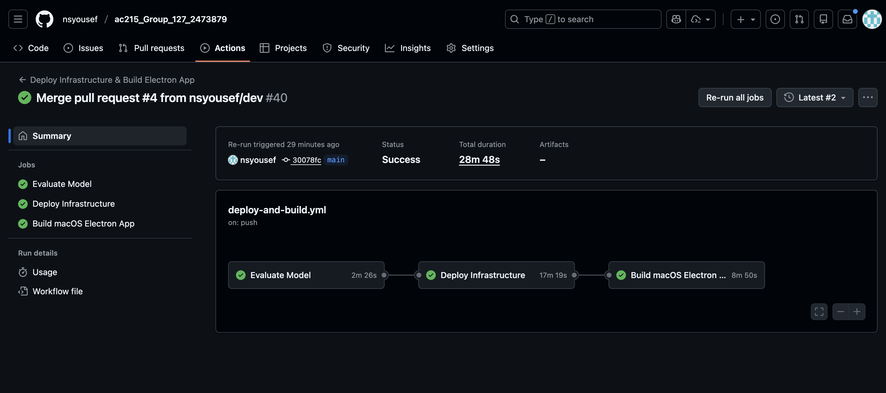

# Milestone 5: Production Deployment and CI/CD

## Technical Implementation

### Kubernetes Deployment

We deployed the cloud part of our inference using Kubernetes. The screenshot of the running instance is here:

#### Scaling Demonstration

Below is the status of the cluster with low to no requests:

We then simulated several requests to the cluster using a python script ([`src/deployment/testload.py`](../../src/deployment/testload.py)):

As the number of the requests increased, the number of pods automatically scales up:

### Pulumi Infrastructure Code

The deployment is automated with pulumi upon merge to main. All the Pulumi code can be found in `src/deployment`. Please see the `README.md` file in that section for more details.

The deployment script deploys the `llm` microservice to Modal. It also deploys the `inference-cloud` microservice to Google Cloud as a Kubernetes cluster.

#### To deploy

To deploy from your local machine, simply run `sudo sh docker-shell.sh` to start the interactive container. Within the interactive container, run `pulumi stack select dev` or `pulumi stack select prod`. Then, run `pulumi up` to deploy everything.

To deploy via the automated pipeline, simply merge the `dev` branch in GitHub into `main`. This will trigger a set of GitHub actions that check that the model meets the performance threshold and deploy the app.

### CI/CD Pipeline Implementation (GitHub Actions)

We previously had a GitHub actions workflow to run linting and testing of each microservice and upload the test results to GitHub's artifact registry. This pipeline still works the same, with minor changes to fix newly introduced bugs.

In this milestone, we added `.github/workflows/deploy-and-build.yml`. This workflow checks that the image classifier model meets the performance threshold for F1 score. It then runs the Pulumi code to deploy everything. It also builds and uploads the .dmg file of the downloaded app to the following public GitHub repository: https://github.com/nsyousef/pibu_ai_model_release/releases

Please note that it was necessary to upload the deployed version of the app to a public repository. The reason for this is private repos on GitHub are limited to 500 MB of storage for artifacts, and our .dmg file alone is larger in size than that. Public repos do not have artifact size limitations, so it was necessary to upload our .dmg to the public repo.

#### Unit Test Suite

Unit tests for each microservice can be found in their respective microservice folder. The location of the unit test files for each microservice is as follows:

* `frontend-react`: unit tests are located in `python/tests`
* `inference-cloud`: unit tests are located in `tests`
* `llm`: unit tests are located in `tests`
* `data-processor`: unit tests are located in `tests/unit`

#### Integration Tests

Integration tests for each microservice can be found in their respective microservice folder. The location of the integration test files for each microservice is as follows:

* `frontend-react`: unit tests are located in `python/tests`
* `inference-cloud`: unit tests are located in `tests`
* `llm`: unit tests are located in `tests`
* `data-processor`: does not currently have integration tests as it is not one of our app's main production services

#### Automated Deployment

Upon merge to the `main` branch, the automated deployment runs successfully. Below is a screenshot of a successful deployment.

#### Test Coverage

Tests can be found for each microservice within their respective microservice folder. In total, our test coverage was about 66.5%.

Test coverage reports are generated by our CI pipeline and can be found in the artifacts for that CI pipeline run. They are named as `coverage-report-<microservice>`.

Within the README files in each microservice, we have included tables showing what files have low test coverage.

#### Data Preprocessing, Training, and Evaluation

The data preprocessing code is at [`src/data-processor/`](../../src/data-processor/). This includes label harmonization, description filtering, and dataset standardization.

The model training code is at [`src/ml_workflow/train/`](../../src/ml_workflow/train/). The main training script is `train.py` which contains the `Trainer` class.

The model evaluation code is implemented as a function in the trainer class (`validate/test`). The evaluation can be run via [`src/ml_workflow/modal_evaluation_volume.py`](../../src/ml_workflow/modal_evaluation_volume.py) for cloud-based evaluation.

#### Automated Retraining and Deployment

As our model is based on a static dataset, automated retraining was not required.

#### Model Validation and Deployment Gates

Only models with a Macro-F1 score of more than 0.5 will be deployed. The validation check is implemented in the CI/CD pipeline at [`.github/workflows/deploy-and-build.yml`](../../.github/workflows/deploy-and-build.yml) in the `evaluate-model` job. The job runs model evaluation using `modal_evaluation_volume.py` and compares the extracted F1 score against the threshold (configurable via `MIN_MODEL_ACCURACY` secret, default 0.5). If the model fails to meet the threshold, the deployment is blocked.
