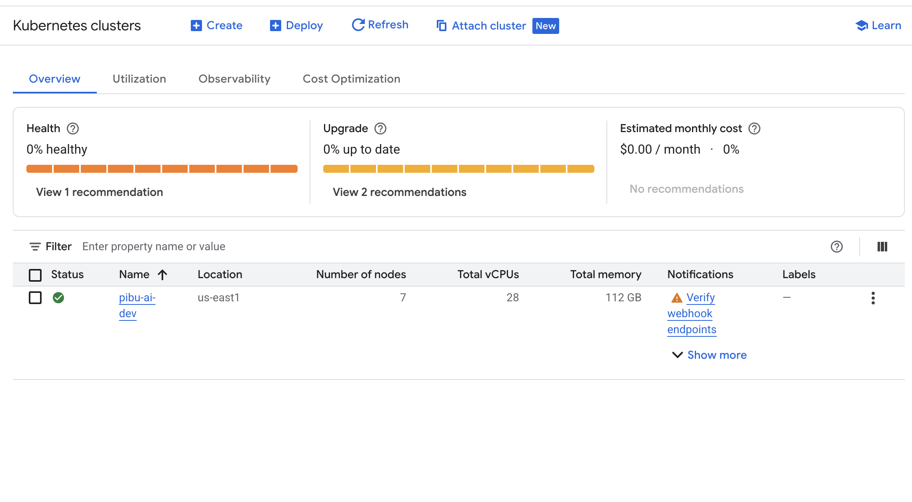
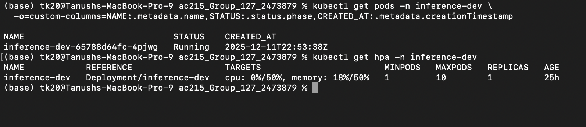
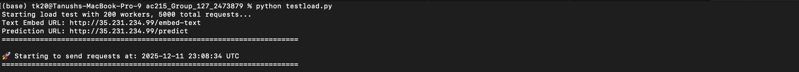
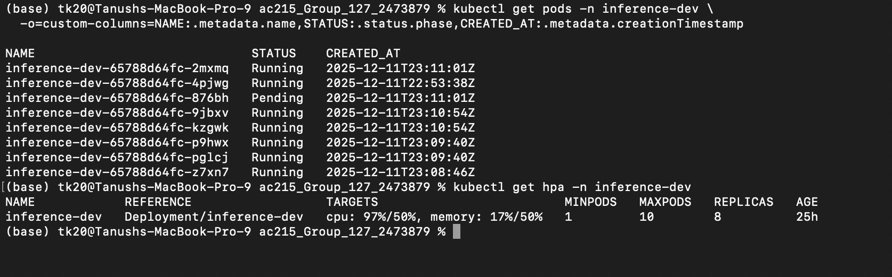

# Milestone 5: Production Deployment and CI/CD

## Technical Implementation

### Kubernetes Deployment

We deployed the cloud part of our inference using Kubernetes. The screenshot of the running instance is here:

#### Scaling Demonstration

Below is the status of the cluster with low to no requests:

We then simulated several requests to the cluster using a python script ([`src/deployment/testload.py`](../../src/deployment/testload.py)):

As the number of the requests increased, the number of pods automatically scales up:

### Pulumi Infrastructure Code

<!-- TODO: Document Pulumi infrastructure automation -->

### CI/CD Pipeline Implementation (GitHub Actions)

<!-- TODO: Document CI/CD pipeline setup and implementation -->

#### Unit Test Suite

<!-- TODO: Document unit test suite for each service/container -->

#### Integration Tests

<!-- TODO: Document integration tests on the codebase -->

#### Automated Deployment

<!-- TODO: Document deployment to Kubernetes cluster upon merging to main branch -->

#### Test Coverage

<!-- TODO: Document test coverage (target: 60% line coverage) and identify uncovered functions/modules -->

### Machine Learning Workflow

<!-- TODO: Document production-ready ML workflow -->

#### Data Preprocessing, Training, and Evaluation

The data preprocessing code is at [`src/data-processor/`](../../src/data-processor/). This includes label harmonization, description filtering, and dataset standardization.

The model training code is at [`src/ml_workflow/train/`](../../src/ml_workflow/train/). The main training script is `train.py` which contains the `Trainer` class.

The model evaluation code is implemented as a function in the trainer class (`validate/test`). The evaluation can be run via [`src/ml_workflow/modal_evaluation_volume.py`](../../src/ml_workflow/modal_evaluation_volume.py) for cloud-based evaluation.

#### Automated Retraining and Deployment

As our model is based on a static dataset, automated retraining was not required.

#### Model Validation and Deployment Gates

Only models with a Macro-F1 score of more than 0.5 will be deployed. The validation check is implemented in the CI/CD pipeline at [`.github/workflows/deploy-and-build.yml`](../../.github/workflows/deploy-and-build.yml) in the `evaluate-model` job. The job runs model evaluation using `modal_evaluation_volume.py` and compares the extracted F1 score against the threshold (configurable via `MIN_MODEL_ACCURACY` secret, default 0.5). If the model fails to meet the threshold, the deployment is blocked.
